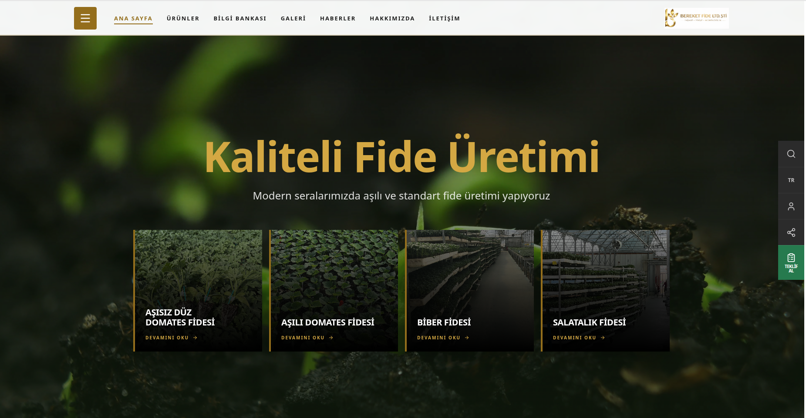
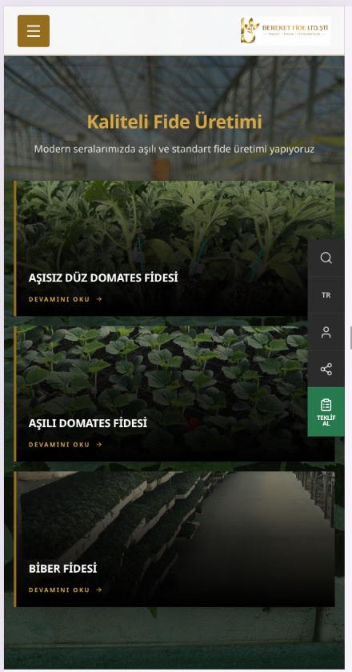

# Bereket Fide

**Kurumsal Web Sitesi, Urun Katalogu ve Icerik Yonetim Sistemi**

Bereket Fide icin hazirlanan bu proje; modern kurumsal tanitim, urun gruplarinin duzenli sunumu,
bilgi merkezi icerikleri ve iletisim/talep akislari icin olusturulan Next.js tabanli web platformudur.

**Canli Site:** [https://www.bereketfide.com](https://www.bereketfide.com)

---

## Ekran Goruntuleri

### Masaustu Gorunumu



### Mobil Gorunumu



---

## Workspace Yapisi

```txt
bereketfide/
  frontend/         <- Next.js 16, port 3030
  backend/          <- Fastify + Drizzle ORM + MySQL, port 8096
  admin_panel/      <- React admin paneli, port 3044
  package.json      <- workspace root
  CLAUDE.md         <- calisma kurallari
  THEMA.md          <- tema kontrati
  PLAN.md           <- uygulama ve icerik plani
  project.portfolio.json
```

---

## Teknoloji Yigini

| Katman   | Teknoloji                                      |
| -------- | ---------------------------------------------- |
| Frontend | Next.js 16, TypeScript, Tailwind CSS v4        |
| Cok dil  | next-intl (TR/EN)                              |
| Veri     | React Query, Zod, React Hook Form              |
| State    | Zustand                                        |
| UI       | Radix UI, Lucide React, Embla Carousel, Sonner |
| Animasyon| Framer Motion                                  |
| Backend  | Fastify, Drizzle ORM, MySQL                    |
| Admin    | React tabanli yonetim paneli                   |
| Deploy   | Nginx, PM2, Let's Encrypt SSL                  |

---

## Ozellikler

- Urun katalogu (liste + detay + galeri)
- TR/EN cok dilli yapi (next-intl)
- Bilgi Bankasi / Haberler
- Galeri sistemi
- Iletisim ve teklif formu
- Token tabanli tema sistemi (basak altini, toprak tonlari)
- Dark / Light mode
- Teknik SEO (canonical, hreflang, JSON-LD, sitemap)
- Admin panel ile icerik yonetimi

---

## Calistirma

```bash
# Frontend (port 3030)
cd frontend && npm install && npm run dev

# Backend (port 8096)
cd backend && npm install && npm run dev

# Admin panel (port 3044)
cd admin_panel && npm install && npm run dev
```

---

## Deployment

- **VPS:** Nginx reverse proxy + PM2
- **SSL:** Let's Encrypt (certbot, otomatik yenileme)
- **Domain:** www.bereketfide.com (canonical, non-www → www redirect)
- **PM2 Servisleri:**
  - `bereketfide-frontend` (port 3040 — standalone build)
  - `bereketfide-backend` (port 8096)
  - `bereketfide-admin` (port 3044)

---

## Ilgili Dosyalar

| Dosya                      | Icerik                              |
| -------------------------- | ----------------------------------- |
| `CLAUDE.md`              | Calisma kurallari ve marka kontrati |
| `THEMA.md`               | Tema, renk ve tipografi sistemi     |
| `PLAN.md`                | Uygulama ve icerik yol haritasi     |
| `project.portfolio.json` | Proje metadata kaynagi              |
